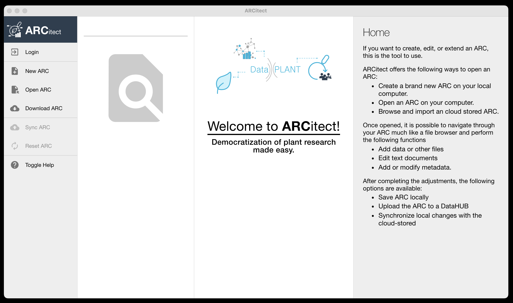

# ARCitect

The **ARCitect** is a tool to create, manage and share your ARCs.  
It adds an intuitive, user-friendly GUI to the [ARC Commander](https://github.com/nfdi4plants/arcCommander). 

:construction: Note, that the **ARCitect** is currently being developed and not ready for standard users, yet. :construction: 

***Preview:***

## Beta Testing

### Prerequisites

Please install the latest version of [Node.js](https://nodejs.org/en/download). 

### Installation

1. Download or clone this repository.
2. Run `npm install` in root directory
3. Run `npm run debug`
4. The ARCitect application starts and is updated as soon as a modification has been saved.

## Contribution

The following quick guide is intended to help content contributors find a starting point.

### Issues

Feel free to [raise an issue](https://github.com/nfdi4plants/ARCitect/issues/new/choose) to let us know what feature is missing or if anything is buggy.

### Help texts

Changes to the help texts can be adjusted in the corresponding document located in the following folder: 

[packages/renderer/src/docs](packages/renderer/src/docs)

### Images

Relevant images can be placed in the following folder: 

[packages/renderer/assets](packages/renderer/assets)

:bulb: Images currently occupy 100% of the width of the help text window.
